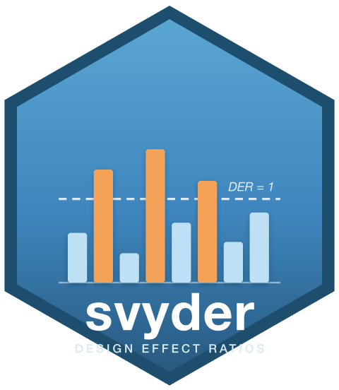
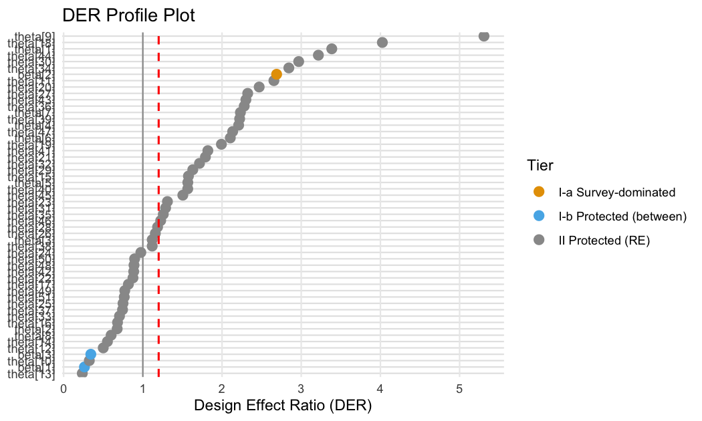

<!-- README.md is generated from README.Rmd. Please edit that file -->

# svyder 

<!-- badges: start -->

[](https://lifecycle.r-lib.org/articles/stages.html#experimental)
[](https://opensource.org/licenses/MIT)
[](https://github.com/joonho112/svyder/actions/workflows/R-CMD-check.yaml)
<!-- badges: end -->

**Design Effect Ratio diagnostics for Bayesian survey models** — *which
parameters actually need a survey-design correction, and which are
better left alone?*

## The problem

When you fit a Bayesian hierarchical model to complex survey data — a
weighted pseudo-posterior — the posterior does not automatically reflect
the sampling design. The usual repair is to rescale the whole posterior
toward a design-based **sandwich** variance. Applied to *every*
parameter that is a mistake: a within-group covariate genuinely needs
its interval widened, but a shrinkage-protected random effect or a
between-group coefficient gets its already-narrow interval crushed.

**svyder** computes a per-parameter **Design Effect Ratio (DER)** — the
ratio of a parameter’s design-based sandwich variance to its model
posterior variance — and uses it to correct only the parameters that
need it.

- **DER \> 1** — the posterior understates design uncertainty → widen
  it.
- **DER ≈ 1** — already calibrated → leave it alone.
- **DER \< 1** — the posterior is already wider than the target →
  correcting would wrongly *narrow* it and destroy the shrinkage
  protection.

## When should I use svyder?

- You fit a Bayesian hierarchical / multilevel model to data from a
  complex survey (unequal weights, clustering, stratification).
- You want to know **which** coefficients and random effects are
  sensitive to the design — not just a single global design effect.
- You want a defensible, **selective** correction rather than a blanket
  rescaling of the whole posterior.

## Installation

``` r
# install.packages("pak")
pak::pak("joonho112/svyder")
```

## Quick start (5 minutes, no Stan required)

svyder ships two datasets with **pre-computed posterior draws**, so you
can run the whole pipeline immediately.

``` r
library(svyder)
data(nsece_demo)   # synthetic, NSECE-like survey data: 6,785 units, 51 states, 644 PSUs

result <- der_diagnose(
  nsece_demo$draws,
  y = nsece_demo$y, X = nsece_demo$X,
  group   = nsece_demo$group,
  weights = nsece_demo$weights,
  cluster = nsece_demo$psu,          # the design PSU  ->  a *design-based* target
  family  = "binomial",
  sigma_theta = nsece_demo$sigma_theta,
  param_types = nsece_demo$param_types,
  verbose = FALSE
)
result
#> svyder diagnostic (54 parameters)
#>   Family: binomial | N = 6785 | J = 51
#>   Target: 644 cluster(s) | meat: centered, DF-corrected | weights: unit_mean
#>   DER range: [0.235, 5.308]
#>   Tier III (DER undefined): sigma_theta
#>   Threshold (tau): 1.20
#>   Flagged: 30 / 54 (55.6%)
#> 
#>   Flagged parameters:
#>     beta[2]              DER = 2.689  [I-a] -> CORRECT
#>     theta[1]             DER = 3.386  [II] -> CORRECT
#>     theta[4]             DER = 2.210  [II] -> CORRECT
#>     theta[5]             DER = 1.568  [II] -> CORRECT
#>     theta[6]             DER = 2.104  [II] -> CORRECT
#>     theta[7]             DER = 2.232  [II] -> CORRECT
#>     theta[9]             DER = 5.308  [II] -> CORRECT
#>     theta[11]            DER = 2.655  [II] -> CORRECT
#>     theta[15]            DER = 1.576  [II] -> CORRECT
#>     theta[18]            DER = 4.025  [II] -> CORRECT
#>     ... and 20 more
#> 
#>   Correction applied: 30 parameter(s) rescaled
#>   Compute time: 0.023 sec
```

`der_diagnose()` runs the three-step **compute → classify → correct**
pipeline in one call.

### Which parameters were flagged?

``` r
head(tidy(result), 3)   # the three fixed effects
#>            term   estimate  std.error       der tier  action flagged
#> beta[1] beta[1]  0.2498445 0.14735061 0.2626885  I-b  retain   FALSE
#> beta[2] beta[2] -0.1494408 0.02604573 2.6894416  I-a CORRECT    TRUE
#> beta[3] beta[3]  0.1610078 0.20239837 0.3430527  I-b  retain   FALSE
#>         scale_factor
#> beta[1]     1.000000
#> beta[2]     1.639952
#> beta[3]     1.000000
```

The within-state poverty coefficient (`beta[2]`) is flagged — Tier I-a,
DER ≈ 2.7 — and its posterior is widened. The two between-state
coefficients sit well below the threshold and are left untouched (Tier
I-b).

### The DER profile

``` r
plot(result, type = "profile")
```



## How to read the output

- **DER** — design-based variance ÷ posterior variance, for each
  parameter.
- **Tier** — **I-a** within-group fixed effects (most exposed), **I-b**
  between-group fixed effects (shielded by shrinkage), **II** random
  effects (shrinkage-protected), **III** hyperparameters (excluded by
  construction).
- **flagged / action** — DER above the threshold (default `tau = 1.2`) →
  the parameter is corrected; otherwise it is retained unchanged.

## The one decision you must make: the variance target

`cluster` is **required** and has no default, because the sandwich
aggregation unit is part of the estimand — the answer can change
materially between a **design-PSU** target and a **model-group** target.
Report both with `der_compare()`:

``` r
comp <- der_compare(result, clusters = list(
  design_psu  = nsece_demo$psu,
  model_group = nsece_demo$group
))
subset(comp, param == "beta[2]")   # poverty coefficient under both targets
#>      param cluster_name      der
#> 2  beta[2]   design_psu 2.689442
#> 56 beta[2]  model_group 1.892591
```

## Key features

- Per-parameter DER with a four-tier classification and **selective
  block-Cholesky** correction — unflagged parameters are left bitwise
  unchanged.
- The **declared variance target** is explicit and recorded in the
  result: aggregation unit, strata, weight convention, and bread
  convention.
- Closed-form **decomposition** (`der_decompose()`) and theorem checks
  (`der_theorem_check()`) linking DER to the Kish design effect and
  hierarchical shrinkage.
- Works from a plain draws matrix or directly from **brms**,
  **cmdstanr**, **rstanarm**, and the **survey** package.
- broom-style `tidy()` / `glance()` and profile / decomposition /
  comparison plots.

## Documentation

Two tracks of vignettes — hands-on workflows and the mathematical
foundations (<https://joonho112.github.io/svyder/>).

**Applied track**

| Article | What it covers |
|----|----|
| [Getting Started](https://joonho112.github.io/svyder/articles/getting-started.html) | the whole pipeline in five minutes |
| [Choosing the Variance Target](https://joonho112.github.io/svyder/articles/choosing-the-target.html) | design-PSU vs model-group, weights, strata |
| [The Compute–Classify–Correct Pipeline](https://joonho112.github.io/svyder/articles/pipeline.html) | the three steps in depth |
| [Case Study: NSECE-Style Survey Data](https://joonho112.github.io/svyder/articles/case-study-nsece.html) | a full worked analysis |
| [Backends](https://joonho112.github.io/svyder/articles/backends.html) | brms, cmdstanr, rstanarm, survey |

**Method track**

| Article | What it covers |
|----|----|
| [The Design Effect Ratio](https://joonho112.github.io/svyder/articles/theory-der.html) | definition and the three regimes |
| [The Declared Variance Target](https://joonho112.github.io/svyder/articles/theory-sandwich.html) | the bread and meat of the sandwich |
| [Decomposition Theorems](https://joonho112.github.io/svyder/articles/theory-decomposition.html) | Theorems 1–2 and the conservation law |
| [Classification and Selective Correction](https://joonho112.github.io/svyder/articles/theory-classification-correction.html) | tiers and block-Cholesky correction |

## Backend support

| Backend | `der_compute()` method | Auto-extracts |
|----|----|----|
| draws matrix | `der_compute.matrix()` | — (you supply everything) |
| brms | `der_compute.brmsfit()` | `y`, `X`, `group`, `family`, `sigma_theta` |
| cmdstanr | `der_compute.CmdStanMCMC()` | draws only (you supply the data) |
| rstanarm | `der_compute.stanreg()` | `y`, `X`, `group`, `family`, `sigma_theta` |
| survey | `extract_design()` | `weights`, `cluster`, `strata` |

You always supply the variance target (`cluster`, and `strata` if
applicable).

## Citation

``` r
citation("svyder")
```

> Lee, J., Williams, M. R., & Savitsky, T. D. (2026). *Design Effect
> Ratios for Bayesian Survey Models: A Diagnostic Framework for
> Identifying Survey-Sensitive Parameters.* Journal of Survey Statistics
> and Methodology. Submitted.

## License

MIT © JoonHo Lee — Assistant Professor, The University of Alabama
([ORCID 0009-0006-4019-8703](https://orcid.org/0009-0006-4019-8703)).
